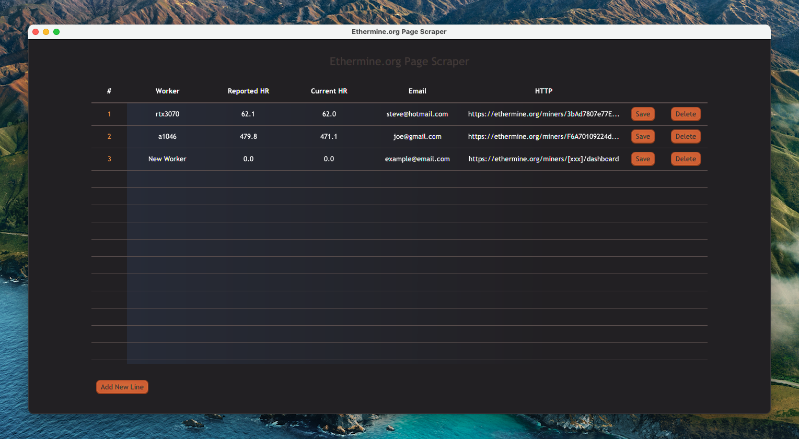

##Ethermine.org Page Scraper

An **Ethermine.org** page scraping utility to send email notifications on miner hash rate changes.

###Setup

Start by cloning the repository and opening it in an IDE. You'll need atleast Java and JavaFX 15.0.1 installed. Then follow the steps:

1. Navigate to [https://chromedriver.chromium.org/downloads]() and find the version of ChromeDriver that matches your operating system and your version of chrome. You can find which version of Chrome you are using by clicking the three dots at the top right of the Chrome window, then
going to Help > About Google Chrome. You should for example see something like 'Version 94.0.4606.61 (Official Build) (arm64)'.

2. Set the credentials in **sender\_email\_details.properties** to the account you would like to send notifications from. This uses Gmail's SMTP server, so please provide a Gmail account. For the provided Gmail account, you will also need to turn on 'Less secure app access' under the Security tab.

From there, run `./gradlew run` to start the JavaFX project. If all goes well, you should see the Ethermine.org Page Scraper dashboard.

###How It Works

The dashboard user interface looks like this. You can create a new entry by clicking the `Add New Line` button. Under the `Worker` field, type the name of the worker you would like to monitor. This has to be a valid active or inactive worker name that exists on the given page. This can be filled out under the `HTTP` field, provide the URL of the miner's dashboard in the form `https://ethermine.org/miners/.../dashboard`. Fill out the `Reported HR` and `Current HR` fields to whichever thresholds you like. If the value for the reported hash rate or current hash rate for the given worker fall below these thresholds (in MH/s), then an email notification is sent to the provided email address (under the `Email` field) detailing the changes.

You can then click the `Save` button, which will persist the entry to the **entries.json** file located in the same directory, as well as start up the scraper. The `Delete` button will remove it. All saved entries will be reloaded on startup. Run the application from a terminal to see more detailed log output.

###Things To Note
* The scraper relies on in page tags as well as element class names. This means that if there is a change to the page source code, then you'll have to modify the XPATH rules inside the `PageScraperService`. As of writting (01/10/2021), this seems to work just fine.
 
* Because the scraper only uses one instance of the ChromeDriver, each entry is handled synchronously, in a single thread, scraped one after the other. For this reason, the number of entries handled per task is set to an arbitrarily high number (10,000 to be exact). The scraper is designed such that it can be multi-threaded, and create new threads for groups of entries. For example, setting the `POOL_SIZE` variable to 5 would create a new thread for each 5 new entries. However, you would need to modify the code to use a driver that can handle asynchronous calls.